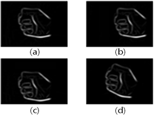
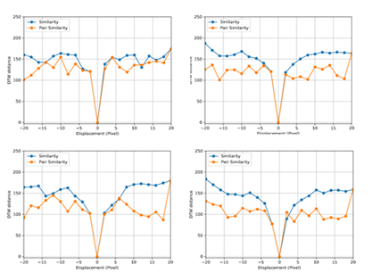

# A Study on Applicability of Autoencoder-based Sensory Substitution Method using Dynamic Time Warping

 

 This is a code for the paper, [A Study on Applicability of Autoencoder-based Sensory Substitution Method using Dynamic Time Warping](./paper.pdf). It validated the [AEV2A](https://github.com/csiki/v2a.git) by extracting MFCC from sounds generated by perturbed images and measuring DTW distance between original and perturbed.
 
 ## Reference
 + https://github.com/csiki/v2a.git

